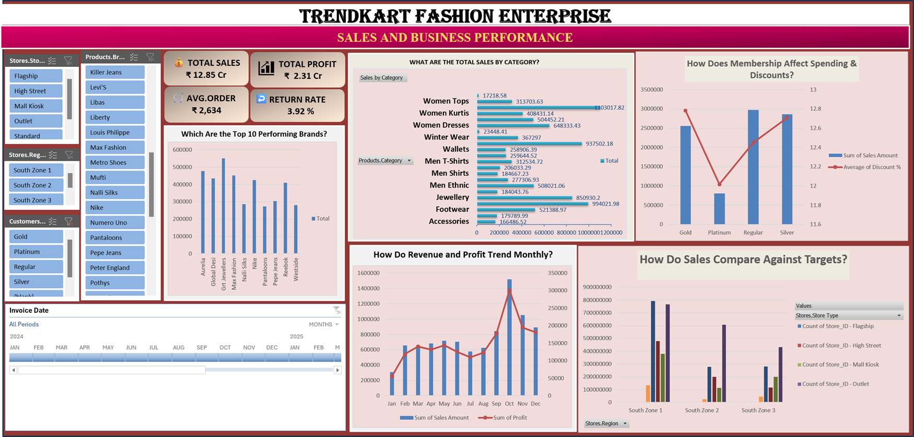

# TrendKart Fashion Enterprise – Sales & Business Analytics

## 1. Project Overview

TrendKart Fashion Enterprise is a retail sales analytics project developed to evaluate sales performance, customer behavior, product performance, store operations, payment patterns, and profitability.

The project uses Microsoft Excel to perform business understanding, data profiling, data cleaning, exploratory analysis, KPI development, Pivot Table analysis, dashboard creation, and generation of actionable business insights.

The objective is to transform raw retail transaction data into meaningful information that can support data-driven business decisions.

## 2. Business Understanding

TrendKart Fashion Enterprise operates across multiple stores and sales channels, serving customers across different regions with a wide range of fashion products and brands.

The business generates transaction-level data containing sales, customers, products, stores, employees, payments, discounts, GST, returns, and profitability information.

Analyzing this data helps management understand what is performing well, where improvements are required, and which areas can contribute to revenue and profit growth.

## 3. Business Questions

The analysis was designed to answer the following key business questions:

1. Which product categories generate the highest sales?
2. Which regions and stores perform better?
3. How do sales and profit change over time?
4. Which brands contribute the most to sales?
5. Which sales channels generate more revenue?
6. Which payment methods are most preferred?
7. What is the impact of product returns?
8. How do membership customers contribute to sales?
9. Who are the highest-value customers?
10. How are stores performing against their targets?

## 4. Dataset Overview

The project contains 3,000 sales transactions supported by customer, product, store, employee, and supplier master data.

| Dataset / Sheet | Records | Purpose |
|---|---:|---|
| Raw Sales Transactions | 3,000 | Original transaction-level sales data |
| Customers | 850 | Customer master information |
| Products | 250 | Product and pricing information |
| Stores | 120 | Store and regional information |
| Employees | 300 | Employee information |
| Suppliers | 90 | Supplier information |
| Sales Cleaned | 3,000 | Final cleaned and enriched sales dataset |
| Data Quality Log | 23 issues | Data-quality documentation |
| Pivot Tables | 179 rows | Analytical summaries |
| Report Metrics | 9 metrics | Dashboard requirements |
| Insights | 6 areas | Business recommendations |

## 5. Data Profiling

Data profiling was performed before analysis to understand the structure, completeness, consistency, and quality of the datasets.

The profiling process examined duplicate records, missing values, inconsistent formats, incorrect spellings, invalid values, formatting issues, and business-rule violations.

A separate Data Quality Log was maintained to document identified issues and the number of affected rows.

## 6. Data Cleaning

The identified quality issues were reviewed and corrected before performing the final analysis.

The cleaning process included removing duplicate invoice records, standardizing dates and categorical values, correcting spelling inconsistencies, handling missing identifiers, converting numeric fields into appropriate data types, removing unwanted spaces, correcting status values, and validating business-related values.

The cleaned datasets were then combined with relevant master-data attributes such as customer membership, product category and brand, store region and type, and employee information.

The final Sales_Cleaned sheet contains 3,000 transactions with 36 analytical columns.

## 7. Data Analysis

Exploratory data analysis was performed using Microsoft Excel to understand sales performance and identify important business trends.

The analysis focused on:

- Product category performance
- Brand performance
- Regional performance
- Store performance
- Monthly sales and profit trends
- Sales channel performance
- Payment mode contribution
- Customer sales contribution
- Membership analysis
- Return performance
- Store target analysis

Pivot Tables, PivotCharts, calculated fields, Excel formulas, aggregations, comparisons, filters, and KPI calculations were used to analyze the data and identify meaningful business patterns.

The analysis helped identify high-performing categories, regions, brands, customer segments, sales channels, payment methods, and areas requiring improvement.

## 8. Key Performance Indicators (KPIs)

The following four KPIs were developed and displayed on the Excel dashboard to monitor overall business performance.

| KPI | Dashboard Value |
|---|---:|
| Total Sales | ₹12.85 Cr |
| Total Profit | ₹2.31 Cr |
| Avg. Order | ₹2,634 |
| Return Rate | 3.92 % |

## 9. Dashboard Development

An interactive Excel dashboard was designed to provide management with a consolidated view of business performance.

The dashboard focuses on the following major metrics and dimensions:

- Total Sales by Product Category
- Regional and Store-Type Performance
- Monthly Revenue and Profit Trends
- Sales Channel Distribution
- Payment Mode Distribution
- Top 10 Performing Brands
- Regional Return Analysis
- Customer Membership Spending
- Top Customers by Sales
- Store Target Distribution

### Dashboard

The dashboard presents the major KPIs and visual analysis required to evaluate TrendKart's sales and business performance.

## 10. Key Insights

### Product Performance

Women Sarees generated the highest category-level sales at approximately ₹11.03 lakh, followed by Handbags and Watches.

### Regional Performance

South Zone 1 generated the highest sales at approximately ₹44.63 lakh, followed by South Zone 2 and South Zone 3.

### Sales Channel Performance

Offline sales contributed approximately ₹60.49 lakh, while Online sales contributed approximately ₹31.78 lakh.

### Payment Mode Performance

UPI recorded the highest sales contribution at approximately ₹26.19 lakh, followed by Credit Card and Debit Card.

### Brand Performance

Grt Jewellers was the highest-performing brand with approximately ₹5.51 lakh in sales, followed by Aurelia and Max Fashion.

### Customer Membership

Regular members generated the highest sales contribution at approximately ₹29.74 lakh, followed by Silver and Gold members.

### Return Performance

Returned transactions represented approximately 4.87% of all transactions and accounted for around 6.23% of total sales value.

### Monthly Performance

October 2024 recorded the highest monthly sales at approximately ₹15.19 lakh, while January 2025 recorded the lowest monthly sales at approximately ₹3.05 lakh.

## 11. Recommendations

### Products

Increase inventory availability for consistently high-performing product categories and brands.

### Regions

Study successful practices from South Zone 1 and apply relevant strategies to lower-performing regions.

### Customers

Strengthen loyalty programs and provide targeted offers based on membership and spending behavior.

### Digital Sales

Improve online promotions and customer engagement to increase the contribution of the online sales channel.

### Payments

Continue promoting UPI and other convenient digital payment options.

### Returns

Analyze major return reasons and improve product information, quality checks, and customer communication.

### Seasonal Sales

Plan targeted promotions around peak sales periods and investigate low-performing months.

### Inventory

Use category, brand, and sales trends to improve inventory planning and product availability.

## 12. Tools & Techniques Used

The project was developed using Microsoft Excel with the following tools and techniques:

- Microsoft Excel
- Excel Tables
- Data Profiling
- Data Cleaning
- Data Validation
- Data Standardization
- Duplicate Identification
- Missing-Value Identification
- Find & Replace
- Excel Formulas
- Lookup Functions
- Calculated Fields
- Pivot Tables
- PivotCharts
- Aggregations
- KPI Development
- Slicers and Filters
- Dashboard Design
- Business Analysis
- Insight Generation
- Business Recommendations

## 13. Project Workflow

The complete project followed a structured analytics workflow:

Business Understanding → Business Problem Definition → Data Collection → Data Profiling → Data Cleaning → Data Transformation → Exploratory Data Analysis → KPI Development → Pivot Analysis → Dashboard Development → Insights → Recommendations

This workflow ensures that the final dashboard is supported by a clean and validated dataset and that the analysis is directly connected to business requirements.

## 14. Project Outcome

The project transformed raw retail transaction data into a structured analytical solution covering sales, profitability, customers, products, stores, regions, channels, payments, and returns.

The final dashboard and analysis provide management with a clear understanding of business performance and highlight opportunities for improving sales, customer retention, inventory planning, digital adoption, and profitability.

## 15. Conclusion

TrendKart Fashion Enterprise demonstrates the end-to-end application of data analytics using Microsoft Excel.

The project combines data profiling, data cleaning, KPI analysis, Pivot Tables, dashboard development, business insights, and recommendations to convert raw business data into actionable information for decision-making.