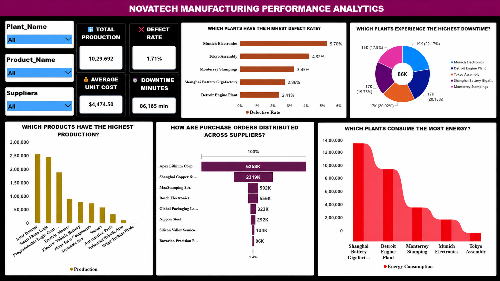

# NovaTech Manufacturing Performance Analysis

## Project Overview

NovaTech Manufacturing Performance Analysis is a Power BI project developed to analyze manufacturing performance across plants, products, and suppliers.

The project focuses on production, quality, downtime, cost, supplier purchasing, and energy consumption to provide actionable business insights through an interactive dashboard.

---

## Project Objective

- Analyze overall manufacturing performance.
- Identify high-performing products and plants.
- Monitor defect rates and downtime.
- Analyze supplier purchase-order distribution.
- Identify high energy-consuming plants.
- Track key manufacturing KPIs.
- Provide actionable insights and recommendations for operational improvement.

---

## Business Understanding

NovaTech needs better visibility into its manufacturing operations to understand production performance, quality issues, downtime, supplier dependency, and energy consumption.

A centralized Power BI dashboard helps management compare plants, products, and suppliers and identify areas that require attention.

---

## Business Problem

The available manufacturing data contains information about production, products, plants, suppliers, purchase orders, defects, downtime, cost, and energy consumption.

The key business questions are:

- Which product has the highest production?
- Which plant has the highest defect rate?
- Which plant has the highest downtime?
- How are purchase orders distributed across suppliers?
- Which plant has the highest energy consumption?
- What are the overall production, defect rate, unit cost, and downtime levels?

---

## Data Profiling

The project uses the following tables:

| Table | Purpose |
|---|---|
| `dim_plants` | Plant information |
| `dim_products` | Product information |
| `dim_suppliers` | Supplier information |
| `fact_production_runs` | Production and operational data |
| `fact_purchase_orders` | Purchase-order data |
| `bridge_bill_of_materials` | Supporting manufacturing data |

### Key Fields

| Area | Fields |
|---|---|
| Plant | `plant_name` |
| Product | `product_name` |
| Supplier | `supplier_name` |
| Production | `quantity_produced` |
| Defects | `quantity_defective` |
| Downtime | `downtime_minutes` |
| Energy | `energy_consumed_kwh` |
| Purchasing | `quantity_ordered` |
| Cost | `unit_cost` |

---

## Data Cleaning and Preparation

The data was prepared in Power BI before analysis.

Key activities included:

- Reviewing tables and fields.
- Identifying fact and dimension tables.
- Checking data consistency.
- Preparing fields for analysis.
- Establishing table relationships.
- Creating calculated measures and columns.
- Applying appropriate aggregations.
- Preparing fields for dashboard visualizations.
- Configuring interactive filters.

---

## Data Analysis

The analysis focused on the following areas:

### Production Analysis
Analyzed production quantities across products to identify the highest-producing products.

### Quality Analysis
Compared defect performance across plants to identify plants with higher defective output.

### Downtime Analysis
Analyzed downtime across plants to identify operational interruptions.

### Supplier Analysis
Compared purchase-order quantities across suppliers to understand supplier distribution.

### Energy Analysis
Compared energy consumption across plants to identify energy-intensive locations.

### Cost Analysis
Used average unit cost as a key indicator of manufacturing cost performance.

---

## Dashboard

The final Power BI dashboard provides an interactive view of NovaTech's manufacturing performance.

### Filters

- Plant Name
- Product Name
- Suppliers

### Key KPIs

| KPI | Value |
|---|---:|
| Total Production | 10,29,692 |
| Defect Rate | 1.71% |
| Average Unit Cost | 4,474.50 |
| Downtime | 86,165 |

### Dashboard Visuals

- Defect Rate by Plant
- Downtime by Plant
- Production by Product
- Purchase Orders by Supplier
- Energy Consumption by Plant

## Dashboard

## Dashboard

## Dashboard

---

## Key Insights

- **Solar Inverter** has the highest production among the products analyzed.
- **Munich Electronics** has the highest defective quantity among the plants shown.
- **Shanghai Battery Gigafactory** has the highest energy consumption among the plants shown.
- **Apex Lithium Corp** has the highest purchase-order quantity among the suppliers shown.
- The overall defect rate is **1.71%**.
- Total production is **10,29,692 units**.
- Total downtime is **86,165 minutes**.
- Average unit cost is **4,474.50**.

---

## Recommendations

### Quality Improvement
Investigate the root causes of higher defective output and strengthen quality-control processes at affected plants.

### Downtime Reduction
Focus on preventive maintenance and root-cause analysis to reduce operational downtime.

### Supplier Diversification
Review supplier concentration and consider alternative suppliers for critical materials.

### Energy Optimization
Investigate energy-intensive plants and identify opportunities to improve energy efficiency.

### Production Planning
Use production trends to improve capacity planning, inventory management, and resource allocation.

---

## Business Value

The dashboard provides management with a centralized view of manufacturing performance and supports:

- Production planning
- Quality improvement
- Downtime reduction
- Supplier management
- Cost monitoring
- Energy optimization
- Data-driven decision-making

---

## Tools & Technologies

- **Power BI**
- **Power Query**
- **DAX**
- **Data Modeling**
- **Data Visualization**
- **GitHub**

---

## Project Workflow

**Data Profiling → Data Cleaning → Data Modeling → DAX → Analysis → Dashboard → Insights → Recommendations**

---

## Conclusion

The NovaTech Manufacturing Performance Analysis project transforms manufacturing data into an interactive Power BI business intelligence solution.

The dashboard provides a clear view of production, quality, downtime, cost, supplier purchasing, and energy consumption, enabling management to identify operational issues and make data-driven decisions.